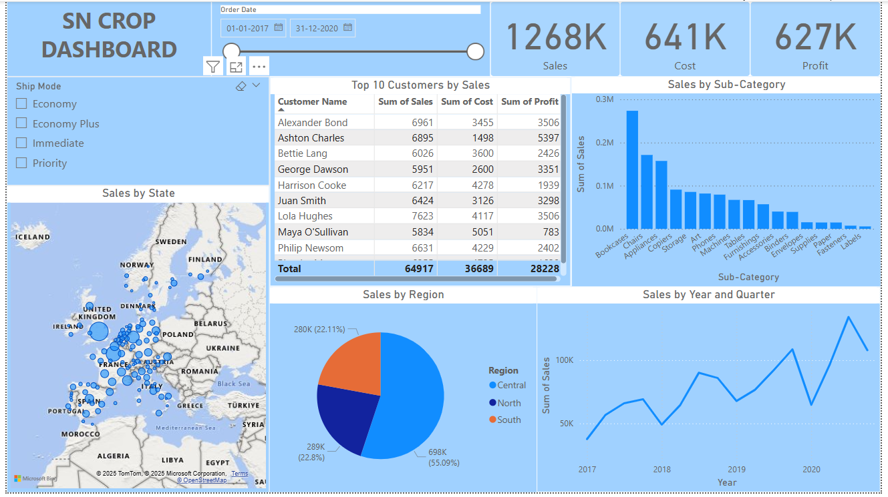

# 📊 SN Crop Dashboard - Power BI Project

This Power BI dashboard provides a comprehensive overview of sales performance for a fictional company, "SN Crop", across multiple regions in Europe. The visuals offer insights into key business metrics, top customers, regional performance, and product categories.

---

## 📌 Key Features

- **Total Sales, Cost, and Profit** KPIs at the top for quick reference.
- **Top 10 Customers by Sales** with breakdowns of sales, cost, and profit.
- **Sales by Sub-Category** using a bar chart to highlight best-selling product categories.
- **Sales by State (Map)** to visualize regional sales distribution across Europe.
- **Sales by Region** shown in a pie chart to understand market share distribution.
- **Sales by Year and Quarter** trend line to monitor growth over time.
- **Ship Mode Filter** to allow dynamic analysis by shipping method.
- **Date Range Filter** to analyze data for a specific time period (2017-2020).

---

## 📂 Files Included

- `SN_CROP_DASHBOARD.pbix`: Main Power BI dashboard file.
- `SN_CROP_DASHBOARD.png`: Screenshot preview of the dashboard.

---

## 🛠️ Tools & Technologies

- **Power BI Desktop**
- **Visualization Techniques**
- **Map Visuals (Microsoft Bing)**

---

## 📷 Dashboard Preview

---

## 📈 Insights Generated

- Central region generated the highest sales (55.09%).
- Most sales came from **Chairs**, **Bookcases**, and **Appliances** sub-categories.
- Sales showed a positive trend over the years, with a noticeable peak in late 2020.

---

## 🚀 How to Use

1. Download the `.pbix` file from this repository.
2. Open it using Power BI Desktop.
3. Explore filters, visuals, and play with slicers to perform your own analysis.

---

## 📬 Contact

If you have any questions or feedback, feel free to reach out via [LinkedIn](https://www.linkedin.com/in/chandana-avusala-805027202/) or email me at 📧 chandana.co.uk@gmail.com.
